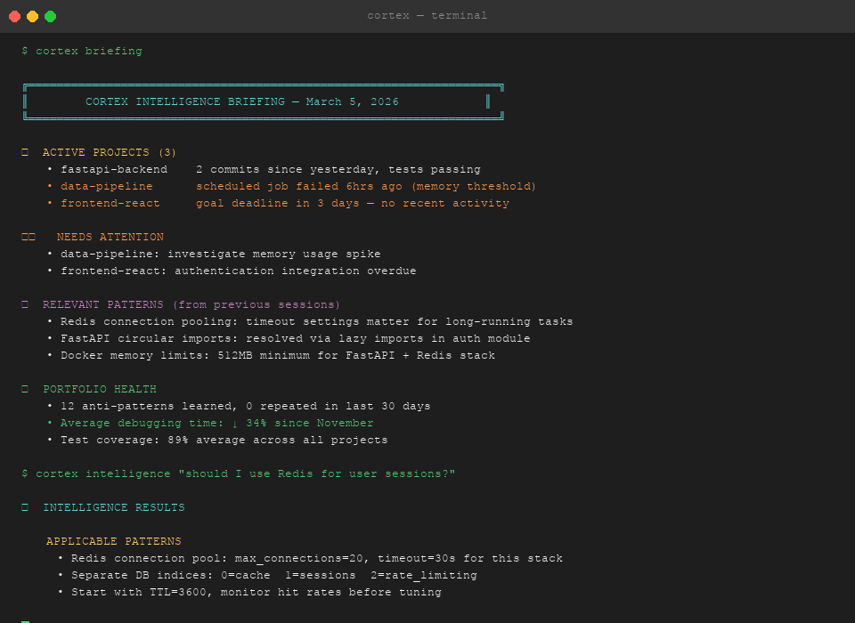
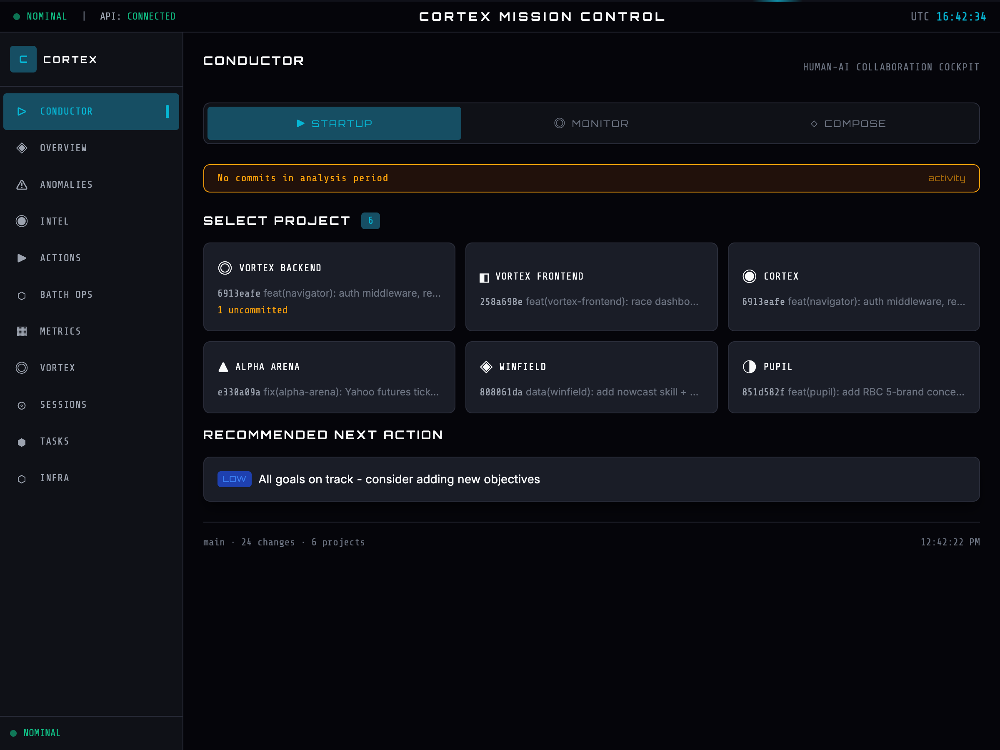

# 🧠 Cortex — Persistent Intelligence for LLM Agents

**Cortex solves session amnesia.** Every time you start a new Claude (or GPT-4, or Gemini) session, it forgets everything: decisions made last week, which approach failed last month, which patterns work in your codebase. Cortex is the infrastructure layer that compensates for this.

> "Cortex is like giving a consultant a well-organized notebook. Same intelligence, vastly different effectiveness."

[](LICENSE)
[](tests/)
[](pyproject.toml)

---

## The Problem

LLMs have no memory between sessions. This creates a systematic productivity tax:

- Repeating context on every session start ("remember, we use ruff for formatting...")
- Re-discovering the same bugs ("oh right, that's the circular import issue")
- Re-explaining architectural decisions that were settled weeks ago
- No accumulation of learned patterns across a project portfolio

This is not an intelligence problem. It is an infrastructure problem. Cortex is the fix.

---

## How It Works in 30 Seconds

```
Session A: You discover a gotcha with GRIB longitude handling.
           Cortex stores it as an anti-pattern with full context.

Session B (next week): You start working on a related module.
           Cortex surfaces the anti-pattern before you hit the bug.
           Claude reads it. You never repeat the mistake.
```

Cortex does not make the LLM smarter. It gives the LLM the right context at the right time.

---

## Architecture

```
┌─────────────────────────────────────────────────────────┐
│                    Your LLM Agent                       │
│          (Claude / GPT-4 / Gemini / any)                │
└──────────────────────┬──────────────────────────────────┘
                       │ MCP or Python SDK
┌──────────────────────▼──────────────────────────────────┐
│                      Cortex                             │
│                                                         │
│  ┌────────────┐  ┌──────────────┐  ┌────────────────┐  │
│  │  Working   │  │   Episodic   │  │   Semantic     │  │
│  │  Memory    │  │   Memory     │  │   Memory       │  │
│  │ (session)  │  │ (past events)│  │(BM25+embedding)│  │
│  └────────────┘  └──────────────┘  └────────────────┘  │
│                                                         │
│  ┌────────────┐  ┌──────────────┐  ┌────────────────┐  │
│  │ Anti-      │  │  Signal      │  │  Contract      │  │
│  │ Patterns   │  │  Detection   │  │  Tasks         │  │
│  └────────────┘  └──────────────┘  └────────────────┘  │
│                                                         │
│  ┌────────────┐  ┌──────────────┐  ┌────────────────┐  │
│  │ Ensemble   │  │  Temporal    │  │  Verifiable    │  │
│  │ Decisions  │  │  Horizon     │  │  Expertise     │  │
│  │ (per-field)│  │  Router      │  │  (trust card)  │  │
│  └────────────┘  └──────────────┘  └────────────────┘  │
│                                                         │
│  ┌─────────────────────────────────────────────────┐    │
│  │  Utilization Learning (closed-loop)             │    │
│  │  observe → learn → adapt → act → repeat         │    │
│  └─────────────────────────────────────────────────┘    │
└─────────────────────────────────────────────────────────┘
                       │
              ┌────────▼────────┐
              │   ~/.cortex/    │
              │  (local store)  │
              └─────────────────┘
```

---

## Core Capabilities

| Capability | What it does |
|---|---|
| **Three-tier memory** | Working (session) → episodic (past events) → semantic with hybrid BM25 + embedding retrieval |
| **Anti-pattern database** | Stores learned mistakes with prevention context. Surfaces them on relevant queries. |
| **Field-level ensemble decisions** | Decomposes model/routing/context/priority decisions into independent fields, each with multiple Bayesian-weighted predictors. Ensemble outperforms any single predictor. *(Vortex-inspired)* |
| **Temporal horizon routing** | Classifies tasks as immediate/session/strategic. Different models, context depth, and learning weights per horizon. *(Vortex-inspired)* |
| **Verifiable expertise** | Every prediction is logged, verified against outcomes, and scored (Brier, calibration). Earns Novice→Master credentials. Shows exactly where Cortex is trustworthy. *(Vortex-inspired)* |
| **Intelligent model routing** | Routes tasks to haiku/sonnet/opus by complexity. Learns from outcome data to adjust selection. |
| **Subscription optimization** | Tracks token utilization against subscription allowances. Learns pacing strategies, suggests batch work to fill idle capacity. |
| **Utilization learning engine** | Closed-loop learning: observes routing decisions, learns user preferences, feeds policies back into routing/model/batch systems. |
| **Goal-to-task pipeline** | Parses GOALS.md into prioritized work items. Discovers tasks from multiple sources. |
| **Interaction capture** | Hooks capture prompts, tool outcomes, and session patterns. Derives implicit feedback signals (corrections, approvals, failure rates). |

---

## Quick Start

```bash
# 1. Install from source
git clone https://github.com/jessekemp1/cortex && cd cortex
pip install -e .

# 2. Set your API key (required for intelligence features)
export ANTHROPIC_API_KEY=sk-...

# 3. Try it out
cortex status                              # see current session context
cortex intelligence "What should I work on next?"   # query the intelligence system
cortex briefing                            # daily context briefing
```

Set `CORTEX_ROOT_DIR=/path/to/projects` to point Cortex at your workspace.

---

## Demo



### Conductor — Human-AI Collaboration Cockpit



The Conductor panel provides a structured startup workflow: select your project, set an intent level (advisory → autonomous), and compose context-rich prompts with one click. It tracks prompt history, monitors active Claude sessions, and surfaces portfolio health across all projects.

**The Compound Intelligence Effect: A realistic morning session**

You open Claude Code to work on your FastAPI project. Last week you debugged a tricky circular import in the auth module. Two months ago you discovered that Redis connection pooling needs specific timeout settings for your use case. Without Cortex, Claude starts fresh — no memory of either lesson.

With Cortex, your session begins differently:

```bash
$ cortex briefing
📊 CORTEX INTELLIGENCE BRIEFING — February 24, 2025

🎯 ACTIVE PROJECTS (3)
  • fastapi-backend: 2 commits since yesterday, tests passing
  • data-pipeline: scheduled job failed 6hrs ago (memory threshold)
  • frontend-react: no recent activity, goal deadline in 3 days

⚠️  NEEDS ATTENTION
  • data-pipeline: investigate memory usage spike
  • frontend-react: authentication integration overdue

🧠 RELEVANT PATTERNS
  • Redis connection pooling: timeout settings matter for long-running tasks
  • FastAPI circular imports: resolved via lazy imports in auth module

🎯 TODAY'S FOCUS
  • Complete Redis caching layer for FastAPI backend
  • Debug data-pipeline memory issue
```

You ask Claude: *"Should I use Redis for caching the user session data?"*

Behind the scenes, Cortex surfaces relevant context to Claude via MCP:

```bash
$ cortex intelligence "should I use Redis for caching user sessions?"

🔍 INTELLIGENCE QUERY RESULTS

📋 SIMILAR WORK
  • 2024-12-15: Implemented Redis caching for API rate limiting
  • 2024-11-28: Session storage comparison (Redis vs PostgreSQL)

🎯 APPLICABLE PATTERNS
  • Redis connection pooling requires max_connections=20, timeout=30s for this deployment
  • Use redis-py with connection_pool for FastAPI background tasks
  • Separate Redis DB indices: 0=cache, 1=sessions, 2=rate_limiting

⚠️  ANTI-PATTERNS
  • DON'T use default Redis timeout (causes 502 errors under load)
  • AVOID storing large objects (>1MB) — use PostgreSQL for user profiles

✅ RECOMMENDATIONS
  • Start with TTL=3600 for user sessions, monitor hit rates
  • Use RedisJSON extension if storing complex session data
  • Set up monitoring on connection pool exhaustion
```

Claude reads this context and gives you a targeted answer — not generic Redis advice, but specific guidance based on what worked (and what failed) in your previous projects.

Later, you're refactoring imports when Cortex proactively surfaces a warning:

```bash
⚠️  ANTI-PATTERN DETECTED: Circular Import Risk

Pattern: importing 'auth.models' at module level in 'models/user.py'
Previous incident: 2024-12-08 in fastapi-backend
Resolution: moved import inside get_current_user() function

Prevent this? [y/N] y
```

**The compound effect**: Over time, your briefings accumulate real context from your project history. Anti-patterns you've documented get surfaced before you repeat them. Session context builds on previous sessions. The more you use it, the more relevant the context becomes.

This is not magic — it is infrastructure. Cortex stores what you've learned so your LLM agent doesn't have to re-learn it every session.

---

## Python SDK

```python
from cortex.bridge import CortexBridge

bridge = CortexBridge(root_dir="/path/to/projects")

# Retrieve relevant context for the current task
context = bridge.get_context("GRIB data processing", project="my-project")

# Query the unified intelligence system
result = bridge.query_intelligence(
    "implement API rate limiting",
    project="my-api",
    query_type="impl"
)
# Returns: similar_work, applicable_patterns, lessons, warnings, recommendations

# Store an anti-pattern so it is surfaced before it recurs
bridge.inject_recommendation(
    title="Never pass raw lon to ds.interp() on 0-360 grids",
    rationale="xarray extrapolates instead of wrapping — returns NaN silently",
    priority="high",
    type="anti_pattern"
)

# Get session context (git branch, recent commits, active goals)
session = bridge.get_session_context()
print(f"Branch: {session['git']['branch']}")
print(f"Active goals: {session['goals']}")
```

Performance: bridge initialization under 10ms, context retrieval under 100ms, intelligence queries under 1s.

---

## CLI Reference

```bash
# Session and status
cortex status                             # current session context
cortex briefing                           # daily intelligence briefing
cortex health                             # system health check

# Intelligence operations
cortex intelligence "<query>"             # query the intelligence system
cortex learn                              # show learning metrics and patterns

# Portfolio (multi-project)
python bridge.py portfolio stats          # cross-project statistics
python bridge.py portfolio patterns       # cross-project patterns
python bridge.py portfolio lessons        # lessons learned

# Dependency analysis
python bridge.py deps <project>           # dependency graph
python bridge.py deps-health <project>    # health score
python bridge.py deps-circular <project>  # circular dependency detection
python bridge.py deps-graph <project> mermaid  # visual export
```

---

## MCP Integration

Cortex exposes a Model Context Protocol server so Claude Desktop and compatible clients can query it as a native tool.

```json
{
  "mcpServers": {
    "cortex": {
      "command": "python",
      "args": ["/path/to/cortex/mcp_server.py"]
    }
  }
}
```

Once registered, Claude can call `cortex_intelligence`, `cortex_recommendations`, and `cortex_anomalies` without prompt engineering on your end.

---

## Comparison with Alternatives

| Tool | Strength | Where Cortex differs |
|---|---|---|
| **Mem0** (49K stars) | Universal memory layer, multi-tenant, great retrieval benchmarks | General-purpose. No developer-workflow primitives (anti-patterns, goal parsing, model routing). |
| **claude-mem** (34K stars) | Claude Code plugin, auto-capture, citation system | Record/replay memory. No task orchestration, no implicit feedback analysis. |
| **Supermemory** (17K stars) | #1 LongMemEval, temporal contradiction handling, auto-forget | Sophisticated retrieval. No work discovery, no cost-optimized model routing. |
| **Windsurf** | Auto-generated memories during conversations | Workspace-isolated. No cross-project transfer, no learning from outcomes. |
| **Cortex** | Developer-workflow-specific: goal parsing, model routing, anti-patterns, orchestration | Smaller community. Memory retrieval less benchmarked than Mem0/Supermemory. |

Cortex is optimized for one use case: **a developer or small team using LLM agents across a multi-project portfolio over months or years.** It combines memory + orchestration in a single system. For multi-tenant user memory at scale, use Mem0. For best-in-class retrieval benchmarks, use Supermemory. For persistent developer intelligence with task routing and cost optimization, Cortex is the right tool.

---

## Data Storage

All data is local by default. Nothing leaves your machine unless you configure an external embedding provider.

```
~/.cortex/
├── config.yaml              # configuration
├── memories/                # episodic and semantic store
├── anti_patterns/           # learned mistakes with prevention context
├── metrics/                 # observability logs (append-only JSONL)
│   ├── model_outcomes.jsonl # task outcomes for learning loops
│   ├── bias_corrections.jsonl
│   └── adaptive_weight_updates.jsonl
├── subscriptions/           # subscription tracking
│   ├── utilization.db       # token usage per billing period
│   └── learning.db          # learned utilization policies
├── ensemble/                # Vortex-inspired decision systems
│   ├── decisions.db         # field-level ensemble audit trail
│   ├── temporal.db          # temporal horizon performance data
│   └── expertise.db         # verifiable prediction track record
└── batches/                 # async job results
```

---

## Installation

**From source:**

```bash
git clone https://github.com/jessekemp1/cortex
cd cortex
pip install -e .                # core (memory, routing, ensemble, learning — stdlib only)
pip install -e ".[llm]"         # + Anthropic SDK (batch API, embeddings)
pip install -e ".[embeddings]"  # + numpy (semantic memory)
pip install -e ".[monitoring]"  # + psutil, structlog, dotenv
pip install -e ".[all]"         # everything
```

**Requirements:** Python 3.11+. Core features (memory, routing, ensemble decisions, utilization learning) work with stdlib only. Set `ANTHROPIC_API_KEY` for LLM-powered intelligence and batch features.

---

## Testing

```bash
pytest tests/ -v
```

958+ tests covering memory retrieval, context optimization, work discovery, model routing, interaction capture, autonomous operations, and the MCP server contract. Assertion quality enforced by AST-based meta-testing (1.8% trivial rate).

---

## Paper

**Cortex: Persistent Intelligence Architecture for LLM-Powered Development Agents**
[PDF](docs/cortex_paper.pdf) *(DOI pending Zenodo upload)*

9-page technical paper covering three-tier memory architecture, hybrid BM25/embedding retrieval, implicit feedback weighting, autonomous operations, AST-based meta-testing, and measured production outcomes (21.2% dedup, 0.94 PQS, 50% batch savings).

---

## Contributing

Issues and pull requests welcome. Before contributing:

1. Run `pytest tests/ -v` — all tests must pass
2. Run `ruff check .` — no lint errors
3. New memory retrieval logic requires tests with specific recall assertions (not `assert result is not None`)

---

## License

Apache 2.0. See [LICENSE](LICENSE).
