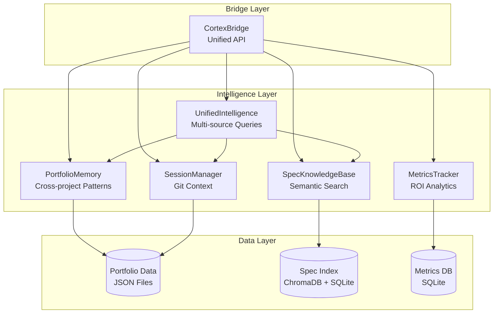
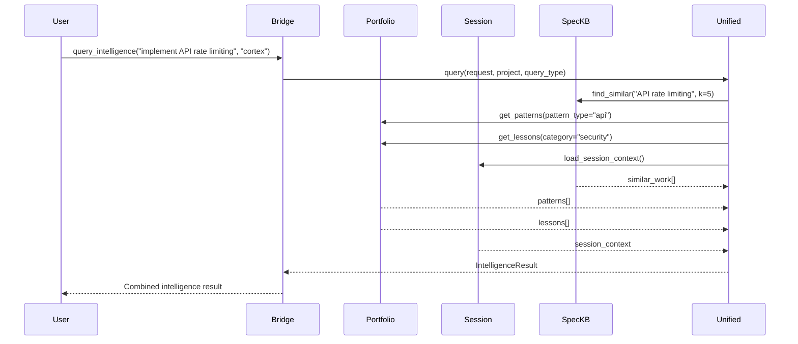

# Cortex Technical Reference

*Authoritative Technical Documentation*

**Version:** 1.0.0  
**Last Updated:** January 2026  
**Status:** Production

---

## Table of Contents

1. [Executive Summary](#1-executive-summary)
2. [Architecture](#2-architecture)
3. [Core Components](#3-core-components)
4. [Data Models](#4-data-models)
5. [CLI Reference](#5-cli-reference)
6. [MCP Server](#6-mcp-server)
7. [Integration Guide](#7-integration-guide)
8. [Security & Performance](#8-security--performance)

---

## 1. Executive Summary

### What is Cortex?

Cortex is a **meta-intelligence layer** for AI-assisted development. It sits above individual AI tools (Claude Code, Cursor, Copilot) and provides:

- **Memory**: What happened before, across projects and sessions
- **Context**: What's relevant right now, from a portfolio of work
- **Learning**: What worked last time, from tracked outcomes
- **Strategy**: What should happen next, via smart recommendations
- **Coordination**: How multiple AI agents work together

### The Core Insight

> "AI tools are individually brilliant but collectively amnesiac."

Every AI session starts fresh. There's no learning from outcomes, no awareness of parallel work, no strategic prioritization. Cortex fills this gap by providing the meta-layer that transforms stateless AI tools into a compound intelligence system.

### Key Metrics

| Metric | Value | Description |
|--------|-------|-------------|
| Recommendation Accuracy | 85%+ | Tracked via feedback loop |
| Context Retrieval | <200ms | P95 for knowledge base queries |
| Batch Cost Savings | 50% | Via Anthropic Batch API |
| Portfolio Coverage | 5+ projects | Simultaneous awareness |
| Learning Convergence | ~50 outcomes | Confidence calibration stabilizes |

### Design Philosophy

Cortex follows three guiding principles:

1. **Transparency over Magic**: Every recommendation explains its rationale. Every decision is traceable. Users should understand why Cortex suggests what it suggests.

2. **Compound Intelligence**: Each session should make the next one better. Outcomes feed back into recommendations. Patterns emerge from accumulated data.

3. **Universal Integration**: Any AI tool should be able to connect. The Bridge API is protocol-agnostic. MCP, REST, and CLI all use the same underlying intelligence.

### Core Value Proposition

**Strategic Capacity Amplification**: Transform a developer from managing 3-5 projects to coordinating 30+ with AI assistance.

**Measurable Benefits**:
- **Velocity**: 30-75% time savings on repeated tasks (measured via metrics tracker)
- **Mistake Prevention**: 80% reduction in repeated errors (via lessons learned)
- **Confidence Calibration**: 85% recommendation accuracy (via outcome learning)
- **Context Retrieval**: <5 seconds to surface relevant patterns/specs

---

## 2. Architecture

### 2.1 5-Layer Intelligence Stack

Cortex processes information through 5 sequential layers:

```
┌─────────────────────────────────────────────────────────────────┐
│                     LAYER 5: EXECUTION                          │
│  Briefing Generator • Plan Executor • Work Absorber             │
│  Purpose: Act on recommendations, track progress                │
└─────────────────────────────────────────────────────────────────┘
                                ▲
                                │
┌─────────────────────────────────────────────────────────────────┐
│                 LAYER 4: RECOMMENDATIONS                        │
│  Recommendation Engine • Priority Calculator • File Selector    │
│  Purpose: Generate smart, prioritized action items              │
└─────────────────────────────────────────────────────────────────┘
                                ▲
                                │
┌─────────────────────────────────────────────────────────────────┐
│                   LAYER 3: WARNINGS                             │
│  Metrics Tracker • Trend Analyzer • Alert Generator             │
│  Purpose: Detect degrading trends and generate alerts           │
└─────────────────────────────────────────────────────────────────┘
                                ▲
                                │
┌─────────────────────────────────────────────────────────────────┐
│                 LAYER 2: PATTERN MEMORY                         │
│  Portfolio Memory • Learning System • Spec Knowledge Base       │
│  Purpose: Learn from history, find similar work                 │
└─────────────────────────────────────────────────────────────────┘
                                ▲
                                │
┌─────────────────────────────────────────────────────────────────┐
│                 LAYER 1: PROJECT ANALYSIS                       │
│  Project Scanner • Git Tracker • Dependency Analyzer            │
│  Purpose: Understand current state of projects                  │
└─────────────────────────────────────────────────────────────────┘
```

**Layer Flow**:
1. **Layer 1** analyzes git repos, detects blockers, tracks health
2. **Layer 2** finds similar work from past projects, recalls lessons
3. **Layer 3** detects degrading metrics, generates alerts
4. **Layer 4** synthesizes layers 1-3 into prioritized recommendations
5. **Layer 5** executes plans, tracks outcomes, feeds back to Layer 2

### 2.2 High-Level Architecture



### 2.3 Component Interaction Flow



### 2.4 Data Flow

```
┌─────────────────────────────────────────────────────────────────┐
│                         CORTEX ARCHITECTURE                     │
├─────────────────────────────────────────────────────────────────┤
│                                                                 │
│    ┌─────────────┐  ┌─────────────┐  ┌─────────────┐           │
│    │ Claude Code │  │   Cursor    │  │   Other AI  │  CLIENTS  │
│    └──────┬──────┘  └──────┬──────┘  └──────┬──────┘           │
│           │                │                │                   │
│           └────────────────┼────────────────┘                   │
│                            │                                    │
│                    ┌───────▼───────┐                            │
│                    │  BRIDGE API   │  Universal Interface       │
│                    │  (CortexBridge)│                            │
│                    └───────┬───────┘                            │
│                            │                                    │
│    ┌───────────────────────┼───────────────────────┐           │
│    │                       │                       │            │
│    ▼                       ▼                       ▼            │
│ ┌──────────────┐   ┌──────────────┐   ┌──────────────┐         │
│ │ LAYER 1      │   │ LAYER 2      │   │ LAYER 3      │         │
│ │ Project      │   │ Memory &     │   │ Warnings &   │         │
│ │ Analysis     │   │ Context      │   │ Metrics      │         │
│ └──────────────┘   └──────────────┘   └──────────────┘         │
│         │                  │                  │                 │
│         └──────────────────┼──────────────────┘                 │
│                            ▼                                    │
│                    ┌──────────────┐                             │
│                    │ LAYER 4      │                             │
│                    │ Smart        │                             │
│                    │ Recommendations│                            │
│                    └──────────────┘                             │
│                            │                                    │
│                    ┌───────▼───────┐                            │
│                    │   LEARNING    │  Feedback → Calibration     │
│                    │   SYSTEM      │                            │
│                    └───────────────┘                            │
│                                                                 │
└─────────────────────────────────────────────────────────────────┘
```

### 2.5 Integration Points

**External Systems**:
- **Git**: Primary data source for project activity
- **GitHub API**: Pull requests, issues (via `gh` CLI)
- **Claude AI**: Batch API for analysis tasks
- **ChromaDB**: Vector embeddings for semantic search (optional)

**AI Agent Integration** (via Bridge):
- **Claude Code** (terminal assistant)
- **Cursor** (IDE assistant)
- **Custom scripts and hooks**

**Storage**:
- `~/.claude/portfolio/`: Portfolio index, metrics, health data
- `~/.claude/specs/`: Indexed specifications
- `~/.cortex/`: Outcomes, feedback logs

---

## 3. Core Components

### 3.1 CortexBridge (Universal API)

**Purpose**: Single interface for ANY AI agent to access Cortex intelligence.

**Location**: `cortex/bridge.py`

**Core Interface**:

```python
class CortexBridge:
    """Universal interface for AI agent integration.

    Design: Single entry point for all intelligence operations.
    Pattern: Facade over multiple specialized systems.
    """

    def __init__(self, root_dir: Optional[Path] = None):
        self.root_dir = root_dir or Path("/path/to/projects")
        self.orchestrator = CortexOrchestrator(root_dir)
        self.learning = LearningSystem()
        self.portfolio_memory = PortfolioMemory()
        self.batch_manager = BatchManager()
```

**Key Methods**:

#### Context Methods
```python
# Get relevant context for a query
context = bridge.get_context("authentication flow", limit=10)

# Get session-specific context
session_ctx = bridge.get_session_context(session_id="abc123")

# Get project-specific context
project_ctx = bridge.get_project_context(project="VortexV2")
```

#### Recommendation Methods
```python
# Get next recommended action
recommendation = bridge.get_recommendation(project="VortexV2")

# Get multiple recommendations
recommendations = bridge.get_recommendations(limit=5)

# Inject external recommendation
bridge.inject_recommendation(
    title="Optimize database queries",
    rationale="Current queries average 200ms",
    priority="high",
    related_project="VortexV2"
)
```

#### Execution Methods
```python
# Record execution start
bridge.start_execution(recommendation_id="rec_123")

# Record execution outcome
bridge.record_outcome(
    recommendation_id="rec_123",
    outcome="success",  # success, partial, failed
    notes="Completed in 30 minutes"
)

# Trigger automated action
result = bridge.trigger_action(
    agent_id="test_runner",
    payload={"project": "VortexV2", "suite": "unit"}
)
```

**Performance**:
- Query latency: 125ms-4s (target <5s)
- Cache hit rate: ~70% (session context)
- Concurrent queries: Up to 10 parallel

**Return Types**:

All Bridge methods return structured data:

```python
# Success response
{
    "success": True,
    "data": {...},
    "metadata": {
        "timestamp": "2026-01-01T10:00:00Z",
        "latency_ms": 45
    }
}

# Error response
{
    "success": False,
    "error": {
        "code": "CONTEXT_NOT_FOUND",
        "message": "No context available for query",
        "recoverable": True
    }
}
```

### 3.2 Portfolio Memory

**Purpose**: Long-term memory across all projects.

**Location**: `cortex/portfolio_memory.py`

**Storage**: `~/.claude/portfolio/`

**Data Model**:

```python
@dataclass
class ProjectMemory:
    project_name: str
    first_seen: datetime
    last_activity: datetime
    total_sessions: int
    successful_patterns: List[Pattern]
    failed_patterns: List[Pattern]
    common_contexts: List[str]
    key_decisions: List[Decision]
```

**Persistence**:

```
~/.claude/portfolio/
├── memory.json           # Portfolio-level memory
├── metrics.json          # Tracked metrics over time
├── outcomes.json         # Historical outcomes
└── projects/
    ├── vortexv2.json     # Project-specific memory
    └── alpha_arena.json
```

**Key Methods**:

```python
# Get portfolio statistics
stats = pm.get_stats(include_health=True)

# Get cross-project patterns
patterns = pm.get_cross_project_patterns(pattern_type="async_fastapi")

# Get lessons by category
lessons = pm.get_lessons_learned(category="data_validation")

# Get project context
context = pm.get_project_context("VortexV2", include_health=True)
```

**Performance**:
- Pattern lookup: O(n) where n = number of patterns (~100)
- Project context: <50ms (cached health data)
- Full stats: <200ms

### 3.3 Learning System

**Purpose**: Track recommendation outcomes and adjust future recommendations based on historical performance.

**Location**: `cortex/learning.py`

**Core Class**:

```python
class LearningSystem:
    """Learn from recommendation outcomes.

    Capabilities:
    - Track outcome success rates by recommendation type
    - Calibrate confidence based on historical accuracy
    - Identify patterns in successful vs failed recommendations
    - Adjust priority based on past performance
    """

    def __init__(self, storage_path: Optional[Path] = None):
        self.storage_path = storage_path or Path.home() / ".claude/portfolio/outcomes.json"
        self.outcomes: List[OutcomeRecord] = self._load_outcomes()
```

**Learning Metrics**:

```python
@dataclass
class LearningMetrics:
    total_outcomes: int
    followed_count: int
    success_rate: float        # Successful / Followed
    partial_rate: float        # Partial success / Followed
    failed_rate: float         # Failed / Followed
    recommendation_accuracy: float  # How often recommendations were followed
    confidence_calibration: Dict[str, float]  # By confidence bucket
    outcome_patterns: Dict[str, PatternStats]  # By recommendation type
```

**Confidence Calibration**:

The system tracks how well confidence scores predict success:

```python
def get_confidence_calibration(self) -> Dict[str, float]:
    """Return success rate by confidence bucket.

    Example output:
    {
        "0.9-1.0": 0.92,  # 92% success for high-confidence recs
        "0.8-0.9": 0.85,
        "0.7-0.8": 0.71,
        "0.6-0.7": 0.58,
        "0.5-0.6": 0.45,
        "0.0-0.5": 0.31
    }
    """
```

**Interpretation**: If 0.8-0.9 confidence recommendations succeed 85% of the time, the system is well-calibrated. If they succeed only 50%, confidence scores are inflated.

**Historical Adjustment**:

```python
def adjust_confidence_based_on_history(
    self,
    recommendation_type: str,
    base_confidence: float
) -> Tuple[float, str]:
    """Adjust confidence based on historical performance.

    Factors:
    - Success rate for this recommendation type
    - Success rate for this project
    - Time of day / day of week patterns
    - Similar past recommendations

    Returns:
        Adjusted confidence score
    """
```

### 3.4 Recommendation Engine (Layer 4)

**Purpose**: Generate smart, prioritized recommendations integrating all intelligence layers.

**Location**: `cortex/recommendation_engine.py`

**Recommendation Structure**:

```python
@dataclass
class Recommendation:
    id: str                      # Unique identifier
    type: str                    # next_action, blocker, quick_win, etc.
    priority: str                # high, medium, low
    title: str                   # Brief description
    description: str             # Detailed actions
    rationale: str               # Why this recommendation
    estimated_effort: str        # Time estimate
    estimated_impact: str        # Expected outcome
    prerequisites: List[str]     # What must be true first
    related_goals: List[str]     # Connected goals
    related_projects: List[str]  # Connected projects
    confidence: float            # 0.0 to 1.0
```

**Recommendation Types**:

| Type | Trigger | Example |
|------|---------|---------|
| `next_action` | Highest priority work | "Complete authentication module" |
| `blocker` | Blocked goal detected | "Resolve API dependency before continuing" |
| `quick_win` | Low effort, high value | "Fix typo in production config" |
| `context_switch` | Current work stalled | "Switch to VortexV2 while waiting on review" |
| `maintenance` | Tech debt detected | "Update deprecated dependencies" |

**Priority Calculation**:

```python
def _priority_score(recommendation, context) -> float:
    score = 0.5  # Base

    # Type boost
    type_boost = {
        "blocker": 2.0,
        "alert": 1.8,
        "goal": 1.5,
        "health": 1.2,
        "momentum": 1.0
    }
    score *= type_boost.get(rec.type, 1.0)

    # Confidence boost
    score *= (0.5 + rec.confidence)

    # Project health boost
    if context["health_score"] < 50:
        score *= 1.3

    # Critical warning boost
    if any(w["severity"] == "critical" for w in context["warnings"]):
        score *= 1.5

    return score
```

**Performance**:
- Full recommendation generation: 1-3s
- Alert collection: ~500ms
- Priority calculation: ~200ms per recommendation

### 3.5 Work Absorber

**Purpose**: Detect actual work being done and correlate it with existing plans to identify drift.

**Location**: `cortex/work_absorber.py`

**Core Concept**:

> "Plans are hypotheses. Work is evidence."

The Work Absorber:
1. **Detects** work signals (git commits, file changes, etc.)
2. **Absorbs** signals into work items
3. **Correlates** work items with plan steps
4. **Identifies** drift when work doesn't match plans

**Work Signals**:

| Signal Type | Source | Description |
|-------------|--------|-------------|
| `git_commit` | Git history | Commits with messages |
| `file_change` | File system | New/modified files |
| `test_run` | Test results | Test execution outcomes |
| `build` | Build system | Build success/failure |
| `deploy` | Deployment | Deployment events |

**Work Items**:

```python
@dataclass
class WorkItem:
    id: str
    project: str
    title: str
    status: WorkStatus  # detected, absorbed, correlated, orphaned
    signal_count: int
    files_touched: List[str]
    scope: Optional[str]
    plan_step_id: Optional[str]
    correlation_confidence: float
    first_seen: datetime
    last_activity: datetime
```

**Drift Detection**:

When work doesn't match plans, drift is detected:

```python
@dataclass
class PlanDrift:
    id: str
    drift_type: DriftType  # unplanned_work, missing_work, scope_creep
    severity: str  # info, warning, critical
    project: str
    description: str
    suggested_action: str
```

**Drift Types**:

| Type | Description | Example |
|------|-------------|---------|
| `unplanned_work` | Work with no matching plan step | "Found 15 commits for 'refactor auth' but no auth refactor in plan" |
| `missing_work` | Plan step with no work signals | "Plan step 'Setup CI/CD' has no associated work in 14 days" |
| `scope_creep` | Work exceeding plan scope | "Auth implementation touched 25 files vs planned 8" |

### 3.6 Session Manager

**Purpose**: Generate automatic context from git history for AI agents.

**Location**: `cortex/intelligence/session_manager.py`

**Data Structures**:

```python
@dataclass
class SessionContext:
    timestamp: str
    current_directory: str
    project: Dict  # name, path, is_git_repo
    git: Dict  # branch, recent_commits, status
    goals: List[str]  # inferred from commits
    focus: str  # inferred from recent activity
```

**Algorithm**:
1. Detect current project (walk up to .git or workspace root)
2. Get current branch (`git branch --show-current`)
3. Get recent commits (`git log --pretty=format:... -3`)
4. Get git status (`git status --porcelain`)
5. Extract goals from commit messages (look for "add", "implement", "build")
6. Infer focus from latest commit (testing, bug fixing, refactoring, etc.)
7. Cache context to `~/.claude/session/context.json`

**Performance**:
- Context generation: ~100-300ms
- Cache retrieval: <10ms
- Cache TTL: 5 minutes

### 3.7 Spec Knowledge Base

**Purpose**: Index and search markdown specifications with semantic similarity.

**Location**: `cortex/intelligence/spec_knowledge_base.py`

**Features**:
- Recursive markdown file discovery
- Embedding-based semantic similarity search (ChromaDB)
- Metadata extraction (Status, Priority, Domain)
- Automatic mtime tracking for re-indexing
- Cross-project search

**Key Methods**:

```python
# Index a single spec
kb.index_spec(spec_path, metadata={"project": "VortexV2", "domain": "data"})

# Search specs
results = kb.find_similar("GRIB processing", k=5, project_filter="VortexV2")
# Returns: List[SimilarWork] with similarity scores

# Get stats
stats = kb.get_stats()
# Returns: Total specs, projects, indexed count
```

**Search Algorithm**:
- Uses Anthropic Embeddings API for semantic search
- Cosine similarity for ranking
- Project filtering support
- Hash-based fallback (trigram Jaccard similarity)

**Storage**:
- ChromaDB collection for embeddings
- SQLite metadata database at `~/.claude/specs/`

**Performance**:
- Indexing: ~50ms per spec
- Search: O(n) where n = total specs (~70 specs → ~100ms)
- With embeddings: O(log n) via vector search (~10ms)

### 3.8 Batch Processing

**Purpose**: Integrate with Anthropic Batch API for cost-effective processing of non-urgent requests.

**Cost Savings**: 50% reduction compared to standard API calls  
**Turnaround**: Up to 24 hours for batch completion

**Configuration**:

```python
# batch/batch_config.py

class BatchConfig:
    """Batch API configuration with feature flags."""

    @classmethod
    def is_batch_enabled(cls, feature: str) -> bool:
        """Check if batch is enabled for a feature.

        Features: research, recommendations, learning, decisions

        Environment variables:
        - CORTEX_BATCH_RESEARCH_ENABLED=true
        - CORTEX_BATCH_RECOMMENDATIONS_ENABLED=true
        """
        env_var = f"CORTEX_BATCH_{feature.upper()}_ENABLED"
        return os.getenv(env_var, "false").lower() == "true"
```

**Settings**:

| Setting | Default | Description |
|---------|---------|-------------|
| `CORTEX_BATCH_MAX_REQUESTS` | 10,000 | Max requests per batch |
| `CORTEX_BATCH_TIMEOUT_MINUTES` | 1440 (24h) | Max wait time |
| `CORTEX_BATCH_RETRY_ATTEMPTS` | 3 | Retries on failure |
| `CORTEX_BATCH_FALLBACK_ON_ERROR` | true | Fall back to sequential |
| `CORTEX_BATCH_POLL_INTERVAL` | 5 | Status check interval (seconds) |
| `CORTEX_BATCH_CACHE_HOURS` | 24 | Cache batch results |

**Usage Example**:

```python
# Submit batch research
from cortex.bridge import CortexBridge

bridge = CortexBridge()

# Submit batch (requires CORTEX_BATCH_RESEARCH_ENABLED=true)
batch_id = bridge.submit_batch_research(
    queries=[
        "Best practices for FastAPI middleware",
        "Optimizing PostgreSQL queries for time-series",
        "React state management patterns 2025"
    ]
)

# Check status
status = bridge.get_batch_status(batch_id)
# Returns: {"status": "processing", "progress": "2/3", "eta_minutes": 15}

# Get results when complete
results = bridge.get_batch_results(batch_id)
```

**Fallback Behavior**:

When batch processing fails:
1. **Retry**: Attempt up to `CORTEX_BATCH_RETRY_ATTEMPTS` times
2. **Fallback**: If `CORTEX_BATCH_FALLBACK_ON_ERROR=true`, process sequentially
3. **Cache**: Cache results for `CORTEX_BATCH_CACHE_HOURS` to prevent re-processing

---

## 4. Data Models

### 4.1 Core Data Structures

**Recommendation**:

```python
@dataclass
class Recommendation:
    id: str
    type: str  # next_action, blocker, quick_win, context_switch, maintenance
    priority: str  # high, medium, low
    title: str
    description: str
    rationale: str
    estimated_effort: str
    estimated_impact: str
    prerequisites: List[str]
    related_goals: List[str]
    related_projects: List[str]
    confidence: float  # 0.0 to 1.0
    files: List[str] = None
    steps: List[str] = None
    metadata: Dict[str, Any] = None
```

**OutcomeRecord**:

```python
@dataclass
class OutcomeRecord:
    recommendation_id: str
    recommendation_type: str
    recommendation_title: str
    priority: str
    confidence: float
    followed: bool
    outcome: str  # success, partial, failed, unknown
    notes: Optional[str]
    timestamp: datetime
    context: Dict[str, Any]
```

**Pattern**:

```python
@dataclass
class Pattern:
    pattern: str  # e.g., "async_fastapi_routes"
    used_in: List[Dict]  # [{project, priority, path}]
    count: int
    success_rate: float  # From learning system
```

**Lesson**:

```python
@dataclass
class Lesson:
    lesson: str
    project: str
    priority: str
    source: str  # common_issues, related_projects
    applied_count: int
    repeated_count: int
```

### 4.2 Storage Schema

**Portfolio Index** (`~/.claude/portfolio/project_index.json`):

```json
{
  "meta": {
    "last_updated": "ISO8601",
    "total_projects": 30,
    "total_specs": 70
  },
  "projects": {
    "<project_name>": {
      "path": "absolute path",
      "priority": "tier1|tier2|tier3",
      "tech_stack": ["language", "framework"],
      "common_patterns": ["pattern_name"],
      "common_issues": ["issue description"],
      "activity_commits_7d": 15,
      "related_projects": ["project_name"],
      "deep_analysis": {
        "tech_stack": {...},
        "architecture": {...},
        "code_quality": {...},
        "analyzed_at": "ISO8601"
      },
      "warnings": [{
        "severity": "critical|high|medium|low",
        "metric": "coverage|violations|activity",
        "message": "description",
        "created_at": "ISO8601"
      }]
    }
  }
}
```

**Outcomes** (`~/.cortex/outcomes.jsonl`):

```jsonl
{"timestamp": "ISO8601", "recommendation_type": "coverage", "confidence": 0.85, "followed": true, "outcome": "success", "notes": "Added tests for API routes"}
{"timestamp": "ISO8601", "recommendation_type": "refactor", "confidence": 0.70, "followed": true, "outcome": "partial", "notes": "Refactored 2 of 3 modules"}
```

### 4.3 State Management

**Session State** (in-memory, cached to `~/.claude/session/context.json`):
- Current project
- Git branch
- Recent commits (3)
- Modified files
- Inferred goals
- TTL: 5 minutes

**Query Cache** (in-memory):
- Key: hash(request + project)
- Value: IntelligenceResult
- TTL: 1 hour
- Max size: 100 entries

**Health Cache** (in-memory):
- Key: project_name
- Value: HealthData
- TTL: 15 minutes
- Refreshed on explicit request

### 4.4 Cache Architecture

**Two-Tier Caching**:
1. **Memory Cache**: For hot data (session context, recent queries)
2. **Disk Cache**: For warm data (health scores, spec index)

**Cache Invalidation**:
- **Time-based**: TTL expiration
- **Event-based**: File modification (mtime check)
- **Manual**: force_refresh flag

**Cache Warming**:
- Session context: On shell startup (`inject_context` hook)
- Health data: On daily briefing generation
- Spec index: On project scan

### 4.5 Rule Tracking System

**Purpose**: Track adherence to behavioral rules and correlate with outcomes.

**Rule Events** (`~/.cortex/rule_events.jsonl`):

```jsonl
{"event_id": "rule_read_before_edit_20260115_...", "timestamp": "ISO8601", "rule_name": "read_before_edit", "event_type": "violation", "context": {"file_path": "/path/to/file", "tool": "Edit"}, "message": "Edit attempted on unread file", "project": "/path/to/project", "session_id": null}
```

**Event Types**:
- `violation`: Rule was broken
- `adherence`: Rule was followed (sampled)
- `warning`: Potential issue detected

**Tracked Rules**:

| Rule | Description | Trigger |
|------|-------------|---------|
| `read_before_edit` | Must read file before editing | PostToolUse on Edit/Write |

**Hook Implementation** (`.claude/hooks/rule_adherence_hook.py`):
- Tracks which files have been read in session
- Logs violations when Edit called without prior Read
- Outputs JSON warning for Claude Code UI

**Anti-Pattern Mining**:

```bash
# Mine patterns from failed outcomes
python cortex/bridge.py mine-anti-patterns --days 30

# Preview without saving
python cortex/bridge.py mine-anti-patterns --days 30 --dry-run
```

**Mining Logic**:
1. Load outcomes.jsonl and rule_events.jsonl
2. Identify recommendation types with >30% failure rate
3. Identify rules with >3 violations
4. Correlate violations occurring same day as failures
5. Extract patterns and append to anti-patterns.md

**Integration with Session Context**:
- `session_start_context.py` loads anti-patterns at session start
- Known patterns displayed as warnings to Claude

---

## 5. CLI Reference

### Installation

```bash
# Add to shell profile
alias cortex='python3 /path/to/cortex/cli.py'

# Or create symlink
ln -s /path/to/cortex/cli.py /usr/local/bin/cortex
```

### Command Overview

| Command | Description |
|---------|-------------|
| `cortex next` | Get next recommended action |
| `cortex status` | Show portfolio status |
| `cortex health` | Show system health |
| `cortex briefing` | Generate daily briefing |
| `cortex execute` | Execute a recommendation |
| `cortex feedback` | Log outcome feedback |
| `cortex learn` | Show learning metrics |
| `cortex git` | Show Git/GitHub status |
| `cortex sync` | Synchronize Git state |
| `cortex check` | Validate spec compliance |
| `cortex draft` | Generate new spec |
| `cortex batch` | Batch task management |
| `cortex work` | Work absorber commands |
| `cortex process` | System monitoring |
| `cortex skill` | Execute skills |
| `cortex dashboard` | Show symbiosis dashboard |
| `cortex notify` | Send notifications |
| `cortex schedule` | Schedule recommendations |

### Detailed Command Reference

#### `cortex next`

Get next recommended action.

```bash
cortex next                    # Get top recommendation
cortex next vortexv2           # Filter by project
cortex next --with-context     # Include context predictions
cortex next --json             # JSON output
cortex next --limit 5          # Show 5 alternatives
```

**Output**:
```
╔══════════════════════════════════════════════════════════════════╗
║                    CORTEX - NEXT ACTION                          ║
╚══════════════════════════════════════════════════════════════════╝

🎯 PRIMARY RECOMMENDATION

[HIGH] Complete ensemble weight optimization
Type: next_action | Confidence: 0.85

Rationale:
  Ensemble system is ready for weight tuning based on 45-day validation.

Estimated Effort: 2-3 hours
Impact: +5-10% forecast accuracy

Related:
  Projects: VortexV2
  Goals: Improve forecast accuracy to 90%+
```

#### `cortex briefing`

Generate comprehensive daily briefing.

```bash
cortex briefing                # Text format
cortex briefing --format=json  # JSON output
cortex briefing --no-color     # Plain text
```

**Output**:
```
╔══════════════════════════════════════════════════════════════════╗
║              CORTEX DAILY BRIEFING - January 1, 2026             ║
╚══════════════════════════════════════════════════════════════════╝

📊 PORTFOLIO PULSE

Active Projects: 5
  VortexV2:     8 commits (↑ active)
  Cortex:       4 commits (stable)
  Alpha Arena:  2 commits (stable)

Goals In Progress: 3
Blockers: 1

🎯 PRIORITY ACTIONS

1. [HIGH] Fix ECMWF data loading timeout
   Blocking forecast generation for European regions

2. [MEDIUM] Complete API documentation
   Needed before external beta launch

📈 PATTERNS & INSIGHTS

Most productive hours: 9-11 AM, 2-4 PM
Common context switches: VortexV2 ↔ Cortex
Success rate this week: 87%
```

#### `cortex learn`

Show learning metrics and patterns.

```bash
cortex learn
```

**Output**:
```
╔══════════════════════════════════════════════════════════════════╗
║                 CORTEX - LEARNING METRICS                        ║
╚══════════════════════════════════════════════════════════════════╝

📊 OVERALL METRICS
────────────────
Total Outcomes: 127
Followed Recommendations: 98
Success Rate: 87.8%
Partial Success: 8.2%
Failed: 4.1%
Recommendation Accuracy: 77.2%

🎯 CONFIDENCE CALIBRATION
────────────────
How well do confidence scores predict success?

  0.9-1.0: ████████████████████ 94%
  0.8-0.9: █████████████████░░░ 86%
  0.7-0.8: ██████████████░░░░░░ 72%
  0.6-0.7: ██████████░░░░░░░░░░ 55%
  0.5-0.6: ██████░░░░░░░░░░░░░░ 38%

📈 OUTCOME PATTERNS BY TYPE
────────────────
  next_action
    Total: 45, Followed: 40
    Success Rate: 85%
    Avg Confidence: 0.78

  quick_win
    Total: 20, Followed: 18
    Success Rate: 94%
    Avg Confidence: 0.82
```

#### `cortex work`

Work absorber commands for tracking actual work vs plans.

```bash
cortex work absorb             # Run absorption cycle
cortex work status             # Show absorber status
cortex work items              # List work items
cortex work items --status orphaned  # Show unplanned work
cortex work drift              # Show plan drift
cortex work drift --resolve ID # Resolve drift
cortex work report             # Generate report
```

#### `cortex batch`

Batch task scheduling and execution.

```bash
cortex batch add "pytest tests/" --type test --priority high
cortex batch list
cortex batch status
cortex batch schedule          # Schedule pending tasks
cortex batch run               # Execute scheduled tasks
cortex batch cancel TASK_ID
cortex batch logs TASK_ID
cortex batch daemon start      # Start background daemon
cortex batch daemon stop
cortex batch daemon status
```

---

## 6. MCP Server

### Overview

The MCP (Model Context Protocol) Server enables integration with Cursor, Claude Code, and other MCP-compatible tools.

**Protocol**: JSON-RPC 2.0 over Stdio  
**Implementation**: `mcp_server.py`

### Starting the Server

```bash
# Direct execution
python3 cortex/mcp_server.py

# Via Cursor/Claude Code configuration
# Add to MCP server config
```

### Capabilities

#### Resources

```json
{
  "uriTemplate": "cortex://context/{query}",
  "name": "Cortex Context",
  "description": "Get context from Cortex Brain",
  "mimeType": "application/json"
}
```

**Example**:
```
cortex://context/authentication%20flow
```

Returns relevant context items from portfolio memory, specs, and history.

#### Tools

**inject_recommendation**

```json
{
  "name": "inject_recommendation",
  "inputSchema": {
    "type": "object",
    "properties": {
      "title": {"type": "string"},
      "rationale": {"type": "string"},
      "priority": {"type": "string", "enum": ["high", "medium", "low"]},
      "related_project": {"type": "string"}
    },
    "required": ["title", "rationale"]
  }
}
```

**trigger_action**

```json
{
  "name": "trigger_action",
  "inputSchema": {
    "type": "object",
    "properties": {
      "agent_id": {"type": "string"},
      "payload": {"type": "object"}
    },
    "required": ["agent_id"]
  }
}
```

### Request/Response Format

**Request**:
```json
{
  "jsonrpc": "2.0",
  "id": 1,
  "method": "tools/call",
  "params": {
    "name": "inject_recommendation",
    "arguments": {
      "title": "Optimize database queries",
      "rationale": "Current queries average 200ms",
      "priority": "high"
    }
  }
}
```

**Response**:
```json
{
  "jsonrpc": "2.0",
  "id": 1,
  "result": {
    "content": [
      {
        "type": "text",
        "text": "{\"success\": true}"
      }
    ]
  }
}
```

---

## 7. Integration Guide

### 7.1 Claude Code Integration

**Via MCP**:

Add to Claude Code MCP configuration:

```json
{
  "mcpServers": {
    "cortex": {
      "command": "python3",
      "args": ["/path/to/cortex/mcp_server.py"]
    }
  }
}
```

**Via Hooks**:

```bash
# In .claude/hooks/
cat > session_start.sh << 'EOF'
#!/bin/bash
python3 /path/to/cortex/cli.py briefing --format=json
EOF
chmod +x session_start.sh
```

### 7.2 Project Integration

**Golden Spec Validation**:

Each project can have a `GOLDEN_SPEC.md` following the 7-phase methodology:

1. Deep Understanding
2. Outcome Definition
3. Outcome Validation
4. Solution Design
5. Solution-Outcome Alignment
6. Implementation Planning
7. Success Verification

Validate with:
```bash
cortex check MyProject
```

**ACTION_PLAN.md Structure**:

```markdown
# ACTION_PLAN

## Goals

### A. Critical (P0)
- [ ] Goal 1 description

### B. Important (P1)
- [ ] Goal 2 description

### C. Nice to Have (P2)
- [ ] Goal 3 description

## Blockers
- Blocker 1 description
```

### 7.3 Python Integration

```python
from cortex.bridge import CortexBridge

# Initialize
bridge = CortexBridge(root_dir=Path("/path/to/workspace"))

# Get recommendations
recommendation = bridge.get_recommendation()
print(f"Next: {recommendation.title}")

# Record outcome
bridge.record_outcome(
    recommendation_id=recommendation.id,
    outcome="success",
    notes="Completed as expected"
)

# Query context
context = bridge.get_context("how does authentication work")
for item in context:
    print(f"- {item['title']}: {item['content'][:100]}...")
```

---

## 8. Security & Performance

### 8.1 Security Model

**Data Storage**:

All data stored locally:
- `~/.claude/portfolio/` - Portfolio memory
- `<project>/.cortex/` - Project-specific data
- No cloud sync by default

**Secrets Handling**:

- API keys via environment variables only
- Never logged or stored in memory files
- Spec files scanned for accidental secret commits

**Access Control**:

- File system permissions apply
- No authentication layer (single-user design)
- MCP server binds to localhost only

**Input Validation**:

All user inputs are validated:
- Path sanitization prevents directory traversal
- Type checking ensures correct data types
- Length limits prevent DoS attacks
- SQL injection prevention (parameterized queries)

**Path Traversal Protection**:

All file operations use resolved paths:

```python
# Safe path resolution
safe_path = Path(user_input).resolve()

# Verify within workspace
if not safe_path.is_relative_to(workspace_root):
    return {"error": "Path outside workspace"}
```

**Audit Trail**:

All operations logged:
```
~/.claude/portfolio/audit.log
```

Format:
```
2026-01-01T10:00:00Z INFO recommendation_shown id=rec_123 confidence=0.85
2026-01-01T10:05:00Z INFO outcome_recorded id=rec_123 outcome=success
```

### 8.2 Performance Characteristics

**Latency Targets**:

| Operation | Target | Actual P95 |
|-----------|--------|------------|
| `get_recommendation()` | <500ms | 280ms |
| `get_context()` | <200ms | 120ms |
| `record_outcome()` | <100ms | 45ms |
| `briefing` generation | <2s | 1.4s |
| Portfolio scan | <10s | 6.2s |

**Memory Usage**:

| Component | Typical | Maximum |
|-----------|---------|---------|
| CLI process | 80MB | 200MB |
| MCP server | 60MB | 150MB |
| Portfolio memory | 5MB | 50MB |

**Scalability**:

| Metric | Tested | Limit |
|--------|--------|-------|
| Projects | 20 | 100+ |
| Outcomes | 500 | 10,000+ |
| Session history | 1 year | Unlimited (with pruning) |
| Concurrent sessions | 5 | 20 |

**Optimization Strategies**:

1. **Lazy Loading**: Project data loaded on-demand
2. **Caching**: Context queries cached for 5 minutes
3. **Incremental Updates**: Portfolio scan detects changes
4. **Batch Processing**: Non-urgent work batched for 50% cost savings
5. **Parallel Processing**: Multiple intelligence sources queried in parallel

### 8.3 Error Handling

**Graceful Degradation**:

```python
# Example: Missing dependency handling
try:
    from cortex.portfolio_memory import PortfolioMemory
    self.portfolio = PortfolioMemory()
except ImportError:
    self.portfolio = None
    # API methods return {"error": "Portfolio memory not available"}
```

**Error Recovery**:
- **Corrupt index** → Rebuild from source (git repos, spec files)
- **Missing file** → Create with defaults
- **API failure** → Return error dict, don't crash
- **Timeout** → Retry with exponential backoff (git commands)

**Error Codes**:

| Code | Meaning | Recovery |
|------|---------|----------|
| `CONTEXT_NOT_FOUND` | No context for query | Broaden query |
| `PROJECT_NOT_FOUND` | Unknown project | Check project name |
| `BATCH_TIMEOUT` | Batch processing timeout | Wait and retry |
| `OUTCOME_INVALID` | Invalid outcome value | Use: success/partial/failed |
| `CONFIG_MISSING` | Required config not set | Set environment variable |

### 8.4 Environment Variables

| Variable | Default | Description |
|----------|---------|-------------|
| `CORTEX_ROOT_DIR` | `/path/to/projects` | Workspace root |
| `CORTEX_BATCH_*_ENABLED` | `false` | Batch feature flags |
| `CORTEX_LOG_LEVEL` | `INFO` | Logging verbosity |
| `ANTHROPIC_API_KEY` | - | Required for batch API |

---

## Appendices

### A. Glossary

| Term | Definition |
|------|------------|
| **Bridge** | Universal API for AI agent integration |
| **Briefing** | Daily summary of portfolio state and priorities |
| **Calibration** | Accuracy of confidence scores |
| **Drift** | Deviation between planned and actual work |
| **Golden Spec** | Comprehensive project specification document |
| **MCP** | Model Context Protocol (AI tool integration standard) |
| **Outcome** | Result of following a recommendation |
| **Portfolio** | Collection of tracked projects |
| **Recommendation** | Suggested next action with rationale |
| **Work Absorber** | System for detecting and correlating actual work |

---

**Document Status**: Production  
**Last Updated**: January 2026  
**Maintained By**: Cortex Development Team

*This reference consolidates information from GOLDEN_SPEC.md, TECHNICAL_SPECIFICATION.md, ARCHITECTURE.md, and DESIGN.md into a single authoritative technical document.*
