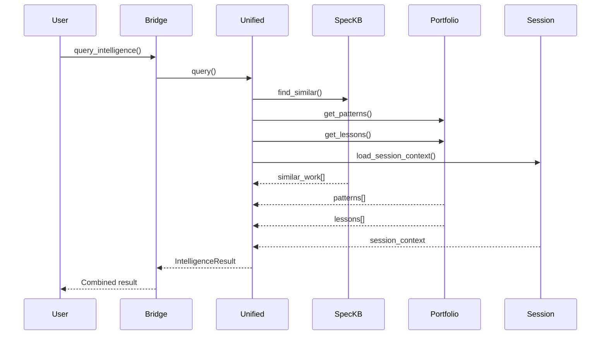

# Architecture Deep Dive

**Detailed component analysis and internal design**

This guide provides an in-depth look at Cortex's internal architecture.

---

## Component Analysis

### Bridge API Architecture

**Purpose**: Unified interface to all Cortex modules

**Design Pattern**: Facade Pattern

**Key Responsibilities**:
- Initialize all sub-systems
- Provide consistent API
- Handle errors gracefully
- Support multiple output formats

**Internal Flow**:
```python
CortexBridge.__init__()
  ├── Initialize PortfolioMemory (lazy)
  ├── Initialize SessionManager (lazy)
  ├── Initialize SpecKnowledgeBase (lazy, may fail)
  └── Initialize UnifiedIntelligence (lazy)
```

---

### Portfolio Memory Architecture

**Data Flow**:
```
Project Detection → Metadata Extraction → JSON Storage → Query Interface
```

**Storage Strategy**:
- JSON files for simple queries
- In-memory caching for performance
- Future: SQLite migration for large portfolios

**Performance Optimizations**:
- Lazy loading
- In-memory caching
- Efficient data structures

---

### Session Manager Architecture

**Context Generation Flow**:
```
Git Repository Detection → Commit Analysis → Goal Extraction → Focus Detection → Context Object
```

**Caching Strategy**:
- Cache for 1 hour (configurable)
- File-based cache (`~/.claude/session/context.json`)
- Automatic invalidation on git changes

---

### Spec Knowledge Base Architecture

**Indexing Flow**:
```
Markdown Discovery → Content Extraction → Embedding Generation → ChromaDB Storage
```

**Search Flow**:
```
Query → Embedding Generation → Similarity Search → Result Ranking → Filtered Results
```

**Storage Strategy**:
- ChromaDB for embeddings
- SQLite for metadata
- Hash-based fallback (if ChromaDB unavailable)

---

## Design Patterns

### Facade Pattern

**Bridge API** provides unified interface to complex subsystems.

### Strategy Pattern

**Search algorithms** (hash-based vs embedding-based) are interchangeable.

### Observer Pattern

**Metrics tracking** observes events and records metrics.

### Factory Pattern

**Agent creation** uses factory pattern for extensibility.

---

## Internal APIs

### Portfolio Memory Internal API

```python
class PortfolioMemory:
    def _load_portfolio() -> Dict[str, Any]
    def _save_portfolio(data: Dict[str, Any]) -> None
    def _get_health_tracker() -> Optional[HealthTracker]
```

### Session Manager Internal API

```python
class SessionManager:
    def _generate_session_context() -> Optional[SessionContext]
    def _detect_project(cwd: Path) -> Optional[str]
    def _get_recent_commits(project_path, limit=5) -> List[Dict]
    def _extract_goals(project_path) -> List[str]
    def _determine_focus(recent_work, project_path) -> str
```

---

## Data Flow Diagrams

### Intelligence Query Flow



---

## Performance Characteristics

### Initialization Performance

- **Bridge Init**: 4.9ms (lazy loading)
- **Component Init**: <1ms each (on first use)

### Query Performance

- **Portfolio Stats**: 0.9ms (cached)
- **Spec Search**: 2.9ms (embedding-based)
- **Session Context**: <300ms (git operations)

---

## Extension Points

See [Extension Points Guide](extension_points.md) for details.

---

**Version**: 1.0  
**Last Updated**: 2025-12-24

