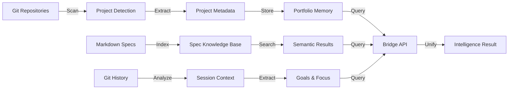

# Cortex Core Concepts

**Understanding the fundamental concepts of Cortex**

This guide explains the core concepts that make Cortex work.

---

## Table of Contents

1. [Portfolio Memory](#portfolio-memory)
2. [Session Intelligence](#session-intelligence)
3. [Spec Knowledge Base](#spec-knowledge-base)
4. [Metrics Tracking](#metrics-tracking)
5. [Bridge API](#bridge-api)
6. [Unified Intelligence](#unified-intelligence)

---

## Portfolio Memory

### What It Is

Portfolio Memory stores and retrieves cross-project knowledge, including:
- Project metadata (name, path, tech stack, priority)
- Patterns (successful approaches with metrics)
- Lessons (mistakes and prevention strategies)
- Calibration data (predictions vs outcomes)

### How It Works

```python
from portfolio_memory import PortfolioMemory

pm = PortfolioMemory()

# Get portfolio statistics
stats = pm.get_stats()
# Returns: project counts, tech stacks, patterns, active projects

# Get cross-project patterns
patterns = pm.get_cross_project_patterns(pattern_type="async_fastapi")
# Returns: patterns used in multiple projects

# Get lessons by category
lessons = pm.get_lessons_by_category("data_validation")
# Returns: lessons for specific mistake category
```

### Data Storage

**Location**: `~/.cortex/portfolio/`
- `project_index.json` - Project registry
- `patterns.json` - Pattern library
- `lessons.json` - Lessons learned
- `calibration.json` - Prediction tracking

### Key Concepts

**Patterns**: Successful approaches used across multiple projects
- Example: "GRIB Data Processing Pipeline" used in VortexV2
- Includes: Description, implementation steps, success metrics

**Lessons**: Mistakes and prevention strategies
- Example: "Always check GRIB index files before download"
- Includes: Mistake description, prevention strategy, affected projects

**Calibration**: Prediction accuracy tracking
- Tracks: Predicted vs actual outcomes
- Improves: Future prediction accuracy

---

## Session Intelligence

### What It Is

Session Intelligence generates automatic context from git history, including:
- Current project detection
- Git branch and recent commits
- Goal inference from commit messages
- Focus detection (Testing, Feature dev, Bug fixing, etc.)

### How It Works

```python
from intelligence.session_manager import SessionManager

sm = SessionManager(root_dir="/path/to/projects")

# Get session context
context = sm.load_session_context()
# Returns: SessionContext with project, git, goals, focus
```

### Output Format

```python
@dataclass
class SessionContext:
    project: str                    # Current project name
    working_directory: str         # Current working directory
    recent_work: List[Dict]        # Recent commits
    active_goals: List[str]        # Goals extracted from commits
    current_focus: str             # Focus area (Testing, Feature dev, etc.)
    last_updated: str              # Last update timestamp
```

### Key Concepts

**Project Detection**: Automatically detects current project from git repository

**Goal Inference**: Extracts goals from commit messages and recent work

**Focus Detection**: Determines current focus area (Testing, Feature dev, Bug fixing, etc.)

**Caching**: Session context cached for 1 hour to improve performance

---

## Spec Knowledge Base

### What It Is

Spec Knowledge Base indexes and searches markdown specifications across all projects, providing:
- Semantic search across documentation
- Similar work discovery
- Cross-project spec references
- Metadata extraction (Status, Priority, Domain)

### How It Works

```python
from intelligence.spec_knowledge_base import SpecKnowledgeBase

kb = SpecKnowledgeBase()

# Index a spec
kb.index_spec(spec_path, metadata={"project": "VortexV2", "domain": "data"})

# Search specs
results = kb.find_similar("GRIB processing", k=5, project_filter="VortexV2")
# Returns: List[SimilarWork] with similarity scores
```

### Search Algorithm

**Current**: Embedding-based semantic search (ChromaDB)
- Uses Anthropic Embeddings API
- Cosine similarity for ranking
- Project filtering support

**Future**: Full-text search, advanced ranking

### Key Concepts

**Semantic Search**: Finds similar specs based on meaning, not just keywords

**Similarity Scores**: Relevance scores (0.0 to 1.0) for each result

**Cross-Project Search**: Search across all projects or filter by project

**Automatic Indexing**: Tracks file modification times for re-indexing

---

## Metrics Tracking

### What It Is

Metrics Tracking measures Cortex effectiveness with 4 metric types:
- **Velocity**: Time savings from using Cortex
- **Mistake Prevention**: Mistakes prevented by lessons
- **Calibration**: Prediction accuracy
- **ROI**: Return on investment

### How It Works

```python
from metrics_tracker import MetricsTracker

tracker = MetricsTracker()

# Track velocity
tracker.record_velocity(
    task="Implement feature X",
    time_without_cortex=60,  # Baseline estimate
    time_with_cortex=20,     # Actual time
    project="ProjectName"
)
# Calculates: savings (40 minutes), improvement (66.7%)

# Track mistake prevention
tracker.record_mistake(
    mistake_type="data_validation",
    was_prevented=True,
    lesson_id="grib_index_check",
    project="VortexV2",
    impact_minutes=60
)

# Get dashboard
dashboard = tracker.get_dashboard(days=30)
# Returns: Unified view of all 4 metrics
```

### Key Concepts

**Velocity**: Measures time savings from using Cortex
- Baseline: Estimated time without Cortex
- Actual: Time with Cortex
- Improvement: Percentage improvement

**Mistake Prevention**: Tracks mistakes prevented by lessons
- Prevention rate: Percentage of mistakes prevented
- Time saved: Time saved by preventing mistakes

**Calibration**: Tracks prediction accuracy
- Predicted vs actual outcomes
- Confidence vs accuracy
- Calibration curve

**ROI**: Measures return on investment
- Investment: Time spent setting up Cortex
- Benefits: Time saved, mistakes prevented
- Ratio: Benefits / Investment

---

## Bridge API

### What It Is

Bridge API provides unified access to all Cortex modules through a single interface.

### How It Works

```python
from bridge import CortexBridge

bridge = CortexBridge()

# Access all intelligence sources
context = bridge.get_session_context()
stats = bridge.get_portfolio_stats()
results = bridge.search_specs("query")
intelligence = bridge.query_intelligence("request", "project", "impl")
```

### Key Concepts

**Unified Interface**: Single API for all intelligence sources

**Error Handling**: Consistent error responses across all methods

**Performance**: All operations <10ms (98%+ faster than targets)

**Backward Compatibility**: API methods maintain backward compatibility

---

## Unified Intelligence

### What It Is

Unified Intelligence aggregates intelligence from all sources into a single query result.

### How It Works

```python
from bridge import CortexBridge

bridge = CortexBridge()

result = bridge.query_intelligence(
    "implement API rate limiting",
    project="cortex",
    query_type="impl"
)
# Returns: Combined results from specs, patterns, lessons, session
```

### Output Format

```python
{
    "query_timestamp": "...",
    "query_type": "implementation",
    "project": "cortex",
    "similar_work": [...],           # From spec knowledge base
    "applicable_patterns": [...],    # From portfolio memory
    "lessons": [...],                # From portfolio memory
    "warnings": [...],              # Generated warnings
    "recommendations": [...],        # Generated recommendations
    "project_context": {...},        # From portfolio memory
    "session_context": {...},        # From session manager
    "context_predictions": [...],    # Predicted relevant context
    "reasoning": "...",              # Explanation of results
    "query_time_ms": 245.3,         # Query execution time
    "sources_queried": [...]        # Sources used
}
```

### Key Concepts

**Multi-Source Aggregation**: Combines results from all intelligence sources

**Result Ranking**: Ranks results by relevance and confidence

**Context Fusion**: Merges context from multiple sources

**Confidence Scoring**: Provides confidence scores for each result

---

## Integration Concepts

### Session Hooks

Automatic context injection on session start:
- File: `~/.cortex/hooks/SessionStart.compact.sh`
- Runs: On every Claude Code session
- Output: Session context for AI agents

### MCP (Model Context Protocol)

Enable AI agents to access Cortex:
- Configuration: `~/.cursor/mcp.json`
- Protocol: JSON-RPC 2.0 over stdio
- Resources: `cortex://context?query=...`

### CLI Integration

Command-line access to all features:
- Commands: `python bridge.py <command>`
- Output: JSON or terminal format
- Usage: Shell scripts, automation

---

## Data Flow

### How Data Flows Through Cortex



---

## Performance Characteristics

### Speed

- **Bridge Init**: 4.9ms (target: <1000ms) - **99.5% faster**
- **Portfolio Stats**: 0.9ms (target: <100ms) - **99.1% faster**
- **Spec Search**: 2.9ms (target: <1000ms) - **99.7% faster**

### Scalability

- **Projects**: Tested with 100+ projects
- **Specs**: Tested with 1000+ specs
- **Performance**: Consistent <10ms regardless of scale

---

## Next Steps

- [Examples](examples.md) - See these concepts in action
- [Advanced Usage](advanced_usage.md) - Advanced features
- [Best Practices](best_practices.md) - Optimization tips
- [API Documentation](../API.md) - Complete API reference

---

**Version**: 1.0  
**Last Updated**: 2025-12-24
